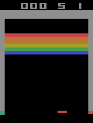
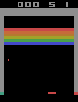
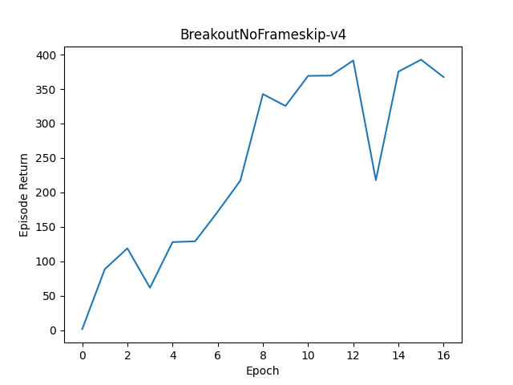

# Simple Decision Transformer Implementation

## Description
This is a code implementation based on the [Decision Transformer](https://arxiv.org/abs/2106.01345).

We collected demonstration data for Atari Breakout using a model trained with [PPO]().
The Decision Transformer is a reinforcement learning method that conditions actions based on rewards to achieve those rewards, but the improvement in accuracy through this method has not been thoroughly demonstrated.
In that regard, there are several examples of imitation learning without using rewards, implemented with a similar architecture, such as [RT-1](https://robotics-transformer1.github.io/) and [Gato](https://arxiv.org/abs/2205.06175).
Instead of using rewards, learning from high-quality demonstration data yields better results.
Therefore, the implementation does not use reward-based conditioning. It relies purely on states and actions.
The demonstration data only includes episodes with a score of 400 or higher from PPO. As a result, the final average score was 396!

Note that, due to the small scale of the implementation, the Transformer has been set with 4 heads and 4 layers each.

## Installation
Run the following command to install the required packages:
```bash
pip install -r requirements.txt
```
The `data.zip` file contains a file named `breakoutnoframeskip_v4.pkl`, which includes episodes with scores of 400 or higher from Atari Breakout.
The `weights.zip` file contains the parameters of the Decision Transformer that have been trained on that data. 
Please extract and use each of them.

## Usage
### Test
If you want to perform a test play with trained parameters, please use the following command.
```bash
python test.py --env_name [ENVIRONMENT_NAME] --load_weights_folder [LOAD_WEIGHTS_FOLDER]
```
Please set the appropriate environment name and folder for each option. Only the `NoFrameskip-v4` Atari environments can be used with this implementation.

## Training
If you want to start training from scratch, run `train.py`. You can check the options by running `python train.py -h`. Make sure to set an appropriate file for `--file_path`. Depending on your machine specifications, configure the `DecisionTransformerConfig` class in `dt/dt.py` accordingly.

### How to Collect Demonstration Data
Here, we provide an example of how to collect demonstration data. Please note that the code shown here will not work if executed as is, so use it for reference only.
```python
import pickle
from pympler import asizeof
from environments.atari_env import AtariEnv

file_size = 2 # Specify the file size. Unit is GB.
file_name = './breakoutnoframeskip_v4.pkl' # Specify the name of the file to save.
env_name = 'BreakoutNoFrameskip-v4' # Specify the appropriate environment name.
return_threshold = 400.0 # Set the score threshold according to the environment.
env = AtariEnv(env_name, frame_skip=4, frame_stack=4) # Create the Atari environment.

model = # Specify the model you are using and load its parameters here.

max_episode_steps = 80000
episodes = []
while True:
    next_state = env.reset()
    episode_return = 0.0
    reward = 0.0
    done = False

    episode = []
    for s in range(max_episode_steps):
        state = next_state
        action = model(state) # The interface of the model you are using may not be like this.

        next_state, reward, done, info = env.step(action)
        
        episode.append((state, action, reward, done, info))
        episode_return += reward

        if done:
            break

    print(f'Episode Return: {episode_return}')

    if episode_return >= return_threshold:
        episodes += episode
        size_gb = asizeof.asizeof(episodes) / (1024**3)
        print(f'Size: {size_gb:.2f} GB')
        if size_gb >= file_size: # Stop when the collected demonstration data exceeds the specified file size.
            break

# Save the data.
with open(file_name, 'wb') as f:
    pickle.dump(episodes, f)
```

## Results
<table>
    <tbody>
        <tr>
            <td colspan="3" style="text-align: center;">BreakoutNoFrameskip-v4</td>
            <td style="text-align: center;">BreakoutNoFrameskip-v4</td>
        </tr>
        <tr>
            <td></td>
            <td></td>
            <td></td>
            <td rowspan="2"></td>
        </tr>
        <tr>
            <td></td>
            <td></td>
            <td></td>
        </tr>
    </tbody>
</table>


